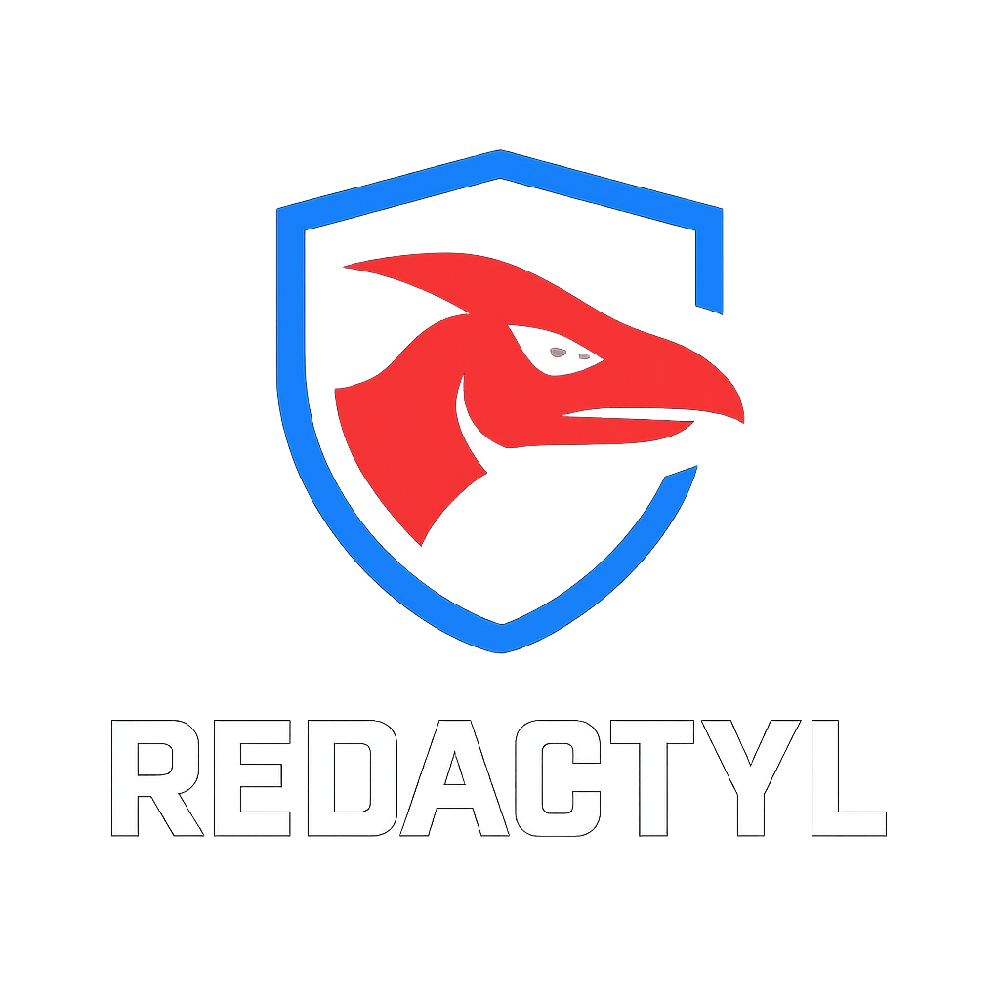

  

OVERVIEW
--------
Redactyl is a web AI preprocessing agent that sits between live webpages and downstream AI systems.

It analyzes webpage HTML, removes hidden or encoded elements, and outputs a sanitized DOM so that AI agents only consume visible, user-facing content.

The goal is not to classify websites as safe or unsafe, but to prevent invisible DOM content from influencing AI behavior.

ARCHITECTURE
------------
1. Live Web Page
   - User opens a real website in the browser
   - Page contains visible and invisible DOM elements

2. Chrome Extension
   - Captures full page HTML using document.documentElement.outerHTML
   - Sends HTML to the backend API

3. Flask Backend (Analysis & Redaction)
   - Hidden DOM detection:
     - display:none
     - visibility:hidden
     - hidden attribute
   - Encoded payload detection:
     - Base64-like strings inside HTML
   - Automatic redaction of detected elements
   - Risk explanation focused on AI relevance

4. Redacted HTML Output
   - Sanitized DOM with hidden and encoded content removed
   - Safe for AI agents to consume

5. Downstream AI Web Agent
   - Receives clean HTML
   - Consumes only visible, user-intended content

FEATURES
--------
- Hidden DOM element detection
- Encoded payload detection
- Automatic redaction (always enabled)
- Risk explanation (informational)
- Chrome extension interface
- Open or copy redacted HTML output

PROJECT STRUCTURE
-----------------

• backend
  - app.py
    Flask API entry point
  - hidden_elements.py
    Hidden DOM detection and redaction
  - encoded_payloads.py
    Encoded payload detection
  - risk_scoring.py
    Risk explanation logic

• extension
  - manifest.json
    Chrome extension configuration
  - popup.html
    Extension UI
  - popup.js
    UI logic and backend communication
  - popup.css
    Dark mode styling
  - assets
    - logo.png
      Redactyl logo

• dataset
  - safe.html
    No hidden or encoded content
  - hidden_only.html
    Hidden DOM elements only
  - encoded_only.html
    Encoded payloads only
  - mixed_risk.html
    Combination of risks

• docs
  - architecture.md
    Architecture explanation
  - evaluation.md
    Effectiveness evaluation

• README.md
• LICENSE

EVALUATION
----------
Redactyl is evaluated using controlled HTML test files.

Each dataset file is:
- Loaded in the browser
- Analyzed using the Chrome extension
- Compared before and after redaction

Observed metrics:
- Number of hidden elements removed
- Number of encoded payloads detected
- Stability of sanitized HTML for AI consumption

RUNNING LOCALLY
---------------
1. Start backend
   python backend/app.py

2. Load Chrome extension
   - Open chrome://extensions
   - Enable Developer Mode
   - Load unpacked and select the extension folder

3. Open any website and click "Analyze Page"

LICENSE
-------
MIT License